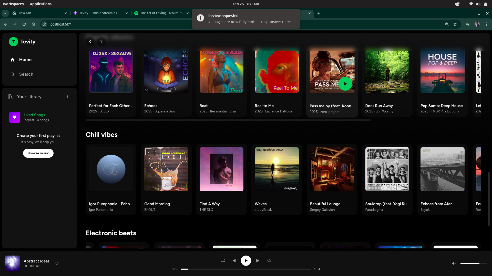
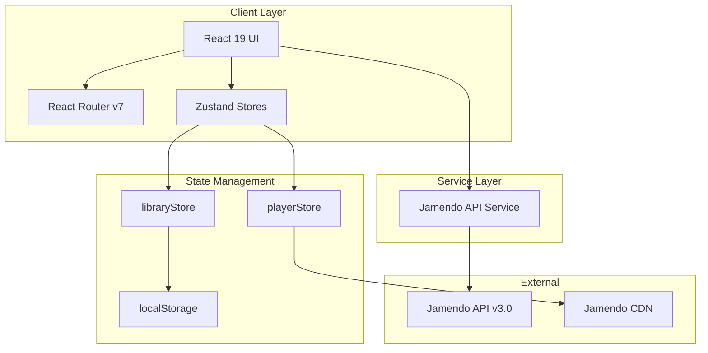
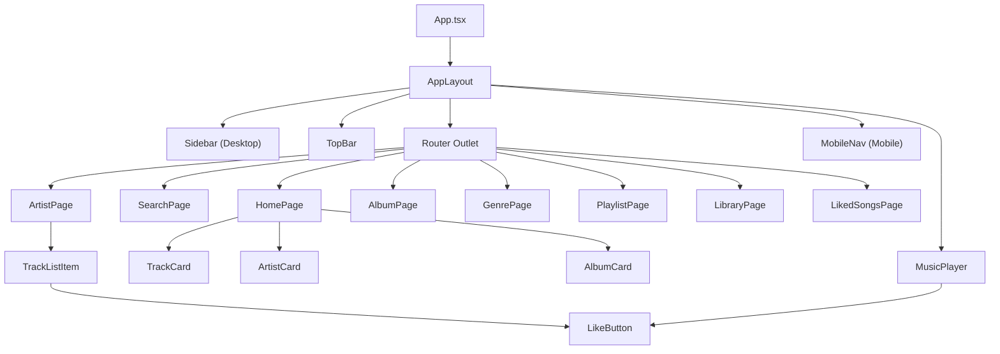
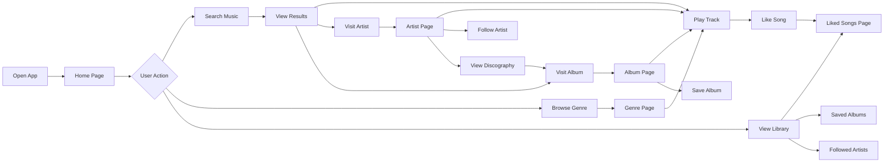
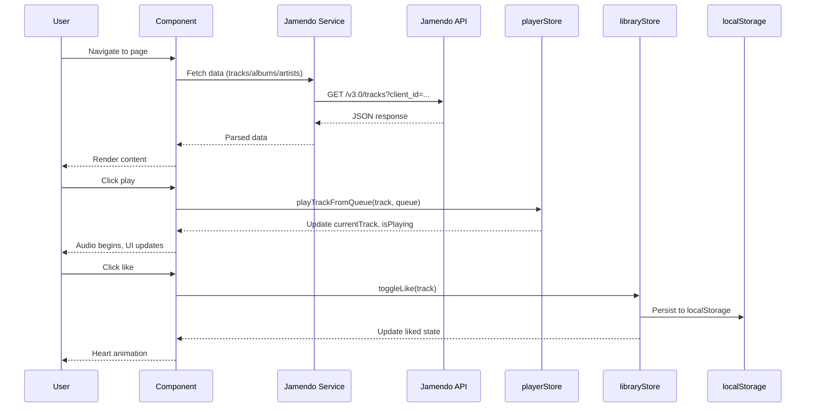

<div align="center">

<h1>TEVIFY</h1>



### A Modern Music Streaming Experience

[](https://react.dev)
[](https://www.typescriptlang.org)
[](https://tailwindcss.com)
[](https://vite.dev)
[](https://zustand-demo.pmnd.rs)

**Tevify** is a feature-rich, Spotify-inspired music streaming web application built with modern web technologies. It delivers a premium listening experience through the Jamendo Creative Commons music catalog, featuring real-time playback, library management, artist discovery, and a fully responsive mobile-first design.

</div>


## Table of Contents

- [Aim](#aim)
- [Problem Statement](#problem-statement)
- [Solution](#solution)
- [Features](#features)
- [Architecture](#architecture)
- [User Flow](#user-flow)
- [Data Flow](#data-flow)
- [Tech Stack](#tech-stack)
- [Project Structure](#project-structure)
- [Getting Started](#getting-started)
- [API Reference](#api-reference)
- [License](#license)


## Aim

Tevify aims to deliver a **production-grade music streaming web application** that replicates the core user experience of Spotify while leveraging openly licensed music from Jamendo. The project serves as both a fully functional product and a technical reference for building complex, state-driven media applications with modern React patterns.

**Key Objectives:**
- Provide seamless music discovery, search, and playback across all devices
- Implement persistent user libraries with liked songs, saved albums, and followed artists
- Achieve visual and functional parity with industry-leading music streaming platforms
- Maintain a responsive, accessible, and performant user interface


## Problem Statement

The current landscape of music streaming presents several challenges for both users and developers:

| Problem | Impact |
|---------|--------|
| **Platform Lock-in** | Major streaming platforms require paid subscriptions and proprietary ecosystems |
| **Limited Open-Source Alternatives** | Few open-source music players offer a modern, Spotify-caliber user experience |
| **Creative Commons Discoverability** | Millions of freely licensed tracks on Jamendo lack an intuitive discovery interface |
| **Mobile-First Gap** | Many web-based music players are built desktop-first, leaving mobile users with degraded experiences |
| **State Complexity** | Managing global playback state, queues, and user libraries across a single-page application is architecturally challenging |


## Solution

Tevify addresses each of these challenges through a carefully architected application:

```
Problem                          Solution
-------------------------------  ----------------------------------------
Platform lock-in                 Free, open-source, no account required
Limited open-source players      Full-featured SPA with Spotify-level UX
CC music discoverability         Integrated Jamendo API with smart search
Mobile-first gap                 Responsive design with compact mini-player
State complexity                 Zustand stores with localStorage persistence
```

**Tevify bridges the gap** between professional streaming platforms and open-source music players by combining Creative Commons music with a premium, responsive interface.


## Features

### Core Playback
- Global audio player with play, pause, skip, previous, shuffle, and repeat controls
- Real-time progress tracking with seekable progress bar
- Volume control with mute toggle
- Queue management with track ordering
- Compact mobile mini-player with progress line indicator

### Music Discovery
- Trending and popular tracks on the home feed
- Popular artists with circular card browsing
- Popular albums and new releases
- Genre-based exploration across 16 music categories
- Real-time debounced search with instant results

### Library Management
- Like/unlike songs with animated heart toggle (persisted to localStorage)
- Save/unsave albums to personal collection
- Follow/unfollow artists
- Dedicated "Liked Songs" playlist with purple gradient header
- Filter tabs (All, Playlists, Artists, Albums) in Your Library

### Pages
- **Home** -- Time-based greeting, trending tracks, popular artists, albums, genre sections
- **Search** -- Real-time search with 16 color-coded genre tiles
- **Artist** -- Artist profile, popular tracks (expandable), discography, follow button
- **Album** -- Album art, tracklist, save button, release info
- **Genre** -- Color-coded gradient header with filtered tracks
- **Playlist** -- Mosaic cover art, tracklist, playback controls
- **Library** -- Tabbed view of all saved content
- **Liked Songs** -- Dedicated playlist with Spotify-style purple gradient

### Design
- Figtree typography (closest match to Spotify's Circular Sp)
- Dark theme with Spotify-inspired green accent (`#1DB954`)
- Framer Motion animations throughout
- Glassmorphism and backdrop blur effects
- Skeleton loading states on all pages


## Architecture

### High-Level System Architecture



### Component Architecture




## User Flow




## Data Flow




## Tech Stack

<div align="center">

| Layer | Technology | Purpose |
|:------|:-----------|:--------|
| **Framework** |  | Component-based UI with hooks |
| **Language** |  | Type-safe development |
| **Build Tool** |  | Lightning-fast HMR and bundling |
| **Styling** |  | Utility-first CSS framework |
| **UI Components** |  | Accessible, composable primitives |
| **State** |  | Lightweight global state management |
| **Routing** |  | Client-side navigation |
| **Animation** |  | Spring-based animations |
| **Icons** |  | Ionicons icon set |
| **Typography** |  | Spotify Circular Sp alternative |
| **API** |  | Creative Commons music catalog |
| **Persistence** |  | Client-side library persistence |

</div>


## Project Structure

```
tevify/
├── public/
├── src/
│   ├── assets/
│   │   └── Tevify-image.png         # App logo
│   ├── components/
│   │   ├── layout/
│   │   │   ├── AppLayout.tsx         # Root layout shell
│   │   │   ├── Sidebar.tsx           # Desktop navigation + library
│   │   │   ├── TopBar.tsx            # Header with mobile logo
│   │   │   └── MobileNav.tsx         # Bottom tab bar
│   │   ├── player/
│   │   │   └── MusicPlayer.tsx       # Dual desktop/mobile player
│   │   ├── ui/                       # shadcn/ui primitives
│   │   ├── AlbumCard.tsx             # Square album card
│   │   ├── ArtistCard.tsx            # Circular artist card
│   │   ├── LikeButton.tsx            # Animated heart toggle
│   │   ├── TrackCard.tsx             # Grid track card
│   │   └── TrackListItem.tsx         # Row track item with like
│   ├── pages/
│   │   ├── HomePage.tsx              # Landing with discovery sections
│   │   ├── SearchPage.tsx            # Search + genre browsing
│   │   ├── ArtistPage.tsx            # Artist detail + discography
│   │   ├── AlbumPage.tsx             # Album detail + tracklist
│   │   ├── GenrePage.tsx             # Genre category tracks
│   │   ├── PlaylistPage.tsx          # Playlist detail
│   │   ├── LibraryPage.tsx           # Your Library (tabbed)
│   │   └── LikedSongsPage.tsx        # Liked songs collection
│   ├── services/
│   │   └── jamendo.ts                # Jamendo API client (15 endpoints)
│   ├── stores/
│   │   ├── playerStore.ts            # Playback state (Zustand)
│   │   └── libraryStore.ts           # Library state (Zustand + persist)
│   ├── lib/
│   │   └── utils.ts                  # Utility functions
│   ├── App.tsx                       # Route definitions
│   ├── main.tsx                      # Entry point
│   └── index.css                     # Global styles + theme tokens
├── index.html                        # HTML template
├── vite.config.ts                    # Vite configuration
├── tailwind.config.ts                # Tailwind configuration
├── tsconfig.json                     # TypeScript configuration
├── package.json
├── GUIDE.md                          # Project requirements doc
└── .env                              # VITE_JAMENDO_CLIENT_ID
```


## Getting Started

### Prerequisites

- **Node.js** >= 18.0
- **npm** >= 9.0
- A free [Jamendo API](https://developer.jamendo.com/v3.0) client ID

### Installation

```bash
# Clone the repository
git clone https://github.com/JonniTech/Spotify-Clone.git
cd Spotify-Clone

# Install dependencies
npm install

# Configure environment variables
cp .env.example .env
```

Add your Jamendo API client ID to `.env`:

```env
VITE_JAMENDO_CLIENT_ID=your_client_id_here
```

### Development

```bash
# Start development server
npm run dev
```

The app will be available at `http://localhost:5174`

### Production Build

```bash
# Build for production
npm run build

# Preview production build
npm run preview
```


## API Reference

Tevify interfaces with the **Jamendo API v3.0** through the following endpoints:

| Function | Endpoint | Description |
|----------|----------|-------------|
| `getPopularTracks` | `/tracks` | Fetch trending tracks by popularity |
| `getTracksByTag` | `/tracks` | Filter tracks by genre tag |
| `searchTracks` | `/tracks` | Full-text search across track catalog |
| `getArtist` | `/artists` | Fetch artist profile and metadata |
| `getArtistTracks` | `/artists/tracks` | Get all tracks by a specific artist |
| `getArtistAlbums` | `/artists/albums` | Get discography for an artist |
| `getPopularArtists` | `/artists` | Discover trending artists |
| `getAlbum` | `/albums` | Fetch album metadata |
| `getAlbumTracks` | `/albums/tracks` | Get tracklist for an album |
| `getPopularAlbums` | `/albums` | Fetch popular albums |
| `searchAlbums` | `/albums` | Search albums by name |
| `getPopularPlaylists` | `/playlists` | Discover curated playlists |
| `getPlaylistTracks` | `/playlists/tracks` | Get tracks in a playlist |
| `getNewReleases` | `/albums` | Fetch recently released albums |

All requests are authenticated via the `client_id` query parameter from the environment variable.


## Responsive Design

Tevify follows a mobile-first responsive strategy:

| Breakpoint | Layout |
|:-----------|:-------|
| `< 768px` (Mobile) | Bottom tab nav, compact mini-player, Tevify logo in header, 2-column grids |
| `>= 768px` (Desktop) | Left sidebar with library, full 3-column player, 5-column grids |

### Mobile Mini-Player
The mobile player displays as a compact bar above the bottom navigation, featuring:
- Track artwork and title
- Like button
- Play/pause toggle
- Thin green progress line at the top edge


## License

This project is open source and available under the [MIT License](LICENSE).

Music content is provided by [Jamendo](https://www.jamendo.com) under Creative Commons licenses.

<div align="center">

---

**Built with precision by NYAGANYA**

[](https://github.com/JonniTech)

</div>
